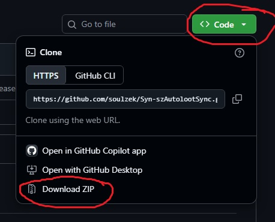
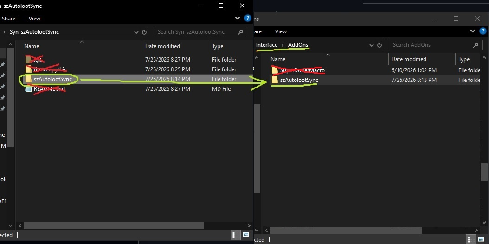
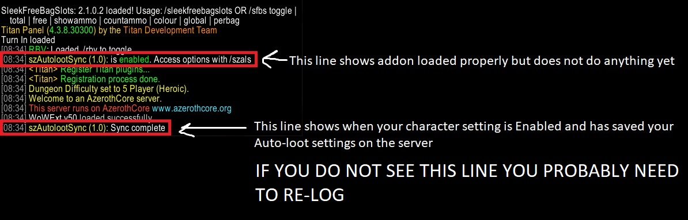
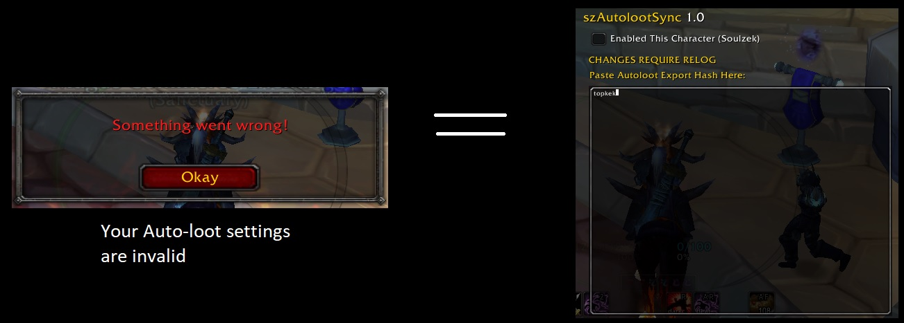

# szAutolootSync 1.0 #
Synastria: Automatically syncs all character's Auto-loot options to the same global configuration

Currently supports 1 global Auto-loot configuration that each character can choose to automatically copy and apply once upon login.

**ANY changes (Hash or Enabled) require a relog to take effect**

## Installation ##

## Help ##

